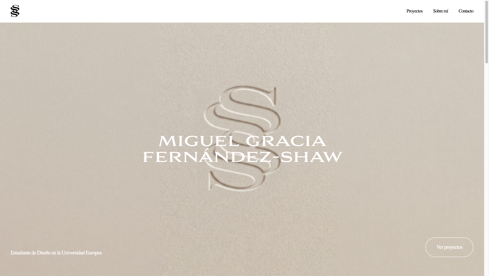

# Portfolio — Miguel Gracia Fernández-Shaw

Sitio web personal con proyectos de diseño gráfico y producto desarrollados durante el Grado en Diseño en la Universidad Europea de Madrid.

**URL en vivo:** https://mickygfs.github.io/portfolio-mg/

**Tech stack:** HTML semántico · CSS (custom properties, Flexbox, Grid, animaciones) · JavaScript vanilla · GitHub Pages

---

## Uso de IA

He usado Claude como asistente durante el desarrollo del proyecto. Me ayudó a generar una base de código HTML, CSS y JavaScript que fui adaptando progresivamente a mis proyectos y a la estética que quería conseguir. En el proceso también tomé como referencia estructuras y soluciones de proyectos anteriores del curso, replicando y adaptando patrones que ya había trabajado. Todas las decisiones de diseño, contenido y estructura las tomé yo.
